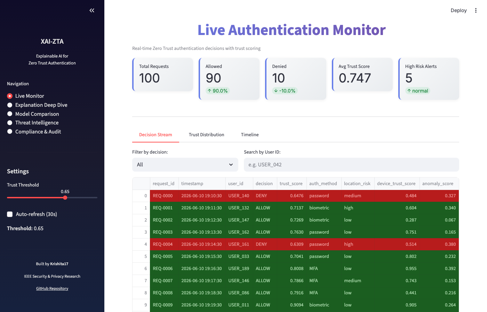
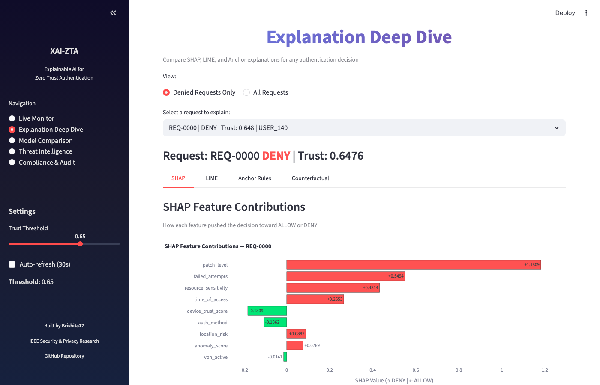
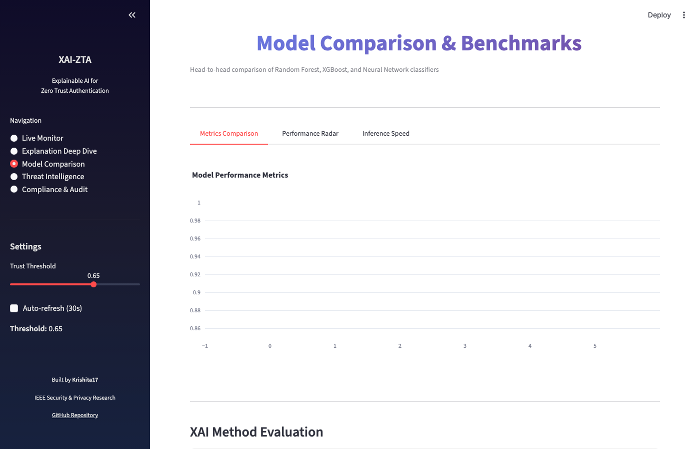
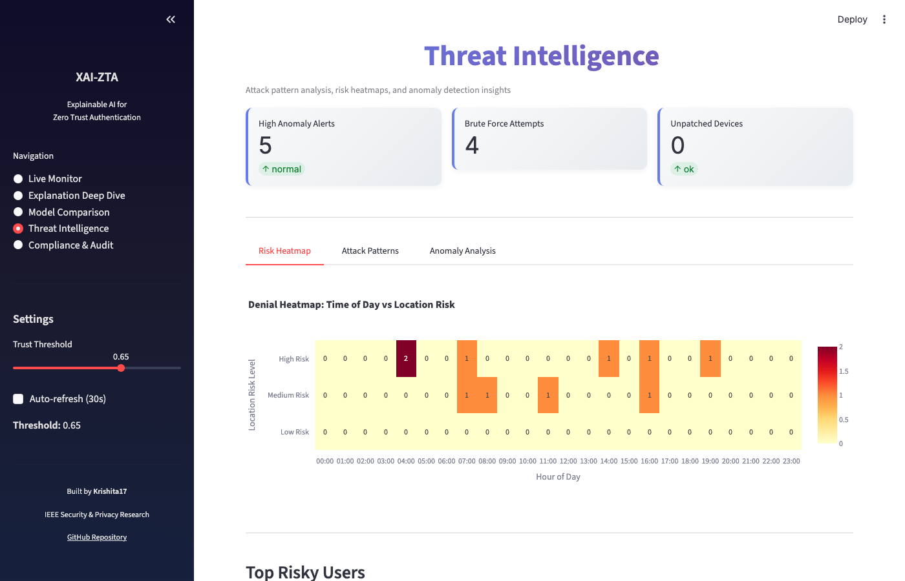
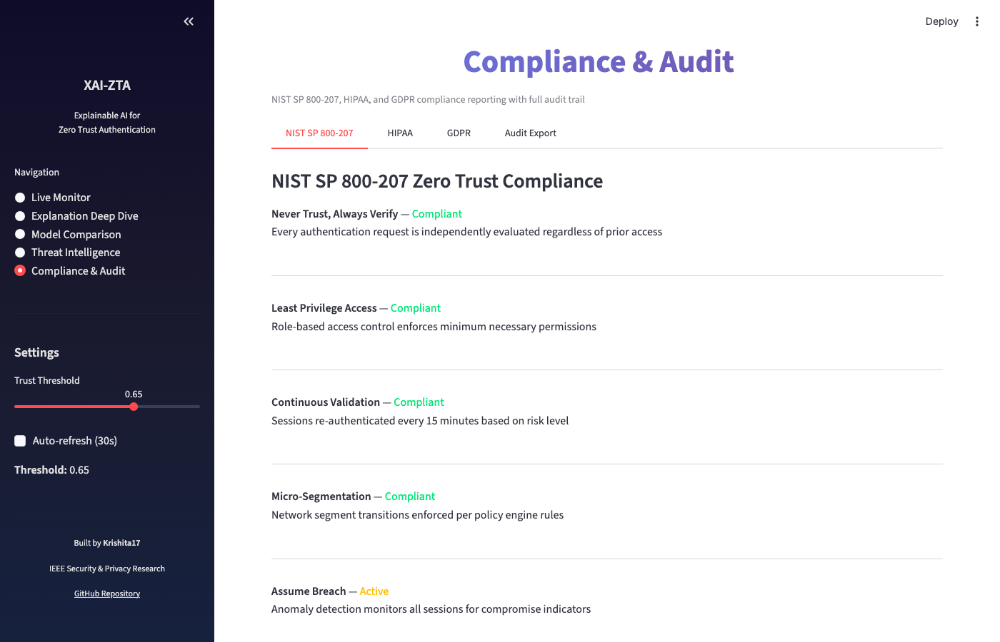
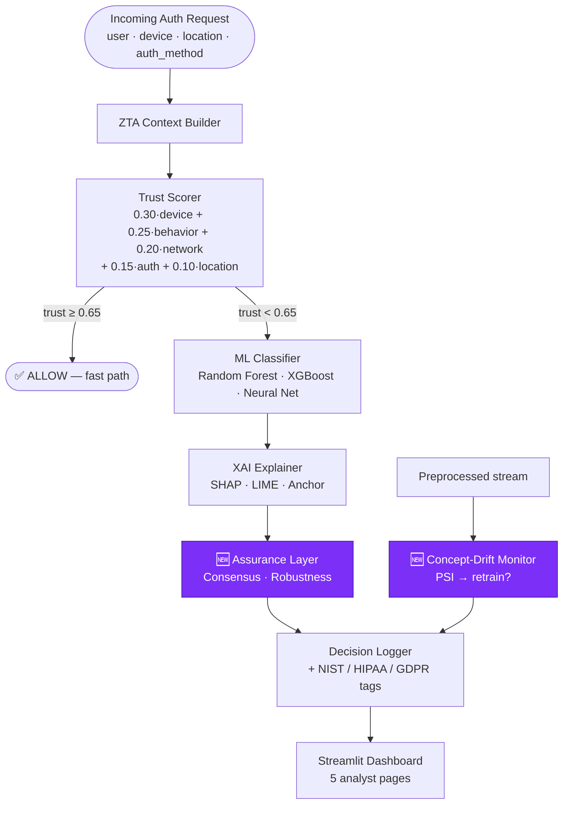

# TrustLens: Explainable AI for Zero Trust Continuous Authentication

> **A complete research system that makes AI-driven access control decisions transparent, trustworthy, and auditable.**

[](https://github.com/Krishita17/TrustLens/actions/workflows/ci.yml)
[](https://github.com/Krishita17/TrustLens/actions/workflows/codeql.yml)
[](https://python.org)
[](LICENSE)
[](trustlens/tests)
[](.github/workflows/ci.yml)

[](trustlens/docs/ARCHITECTURE.md)
[](https://csrc.nist.gov/publications/detail/sp/800-207/final)
[](trustlens/docs/THREAT_MODEL.md)
[](https://streamlit.io)

> **Topics:** `trustworthy-ai` · `ai-assurance` · `explainable-ai` · `xai` · `interpretable-machine-learning` · `zero-trust` · `shap` · `lime` · `anchor` · `adversarial-machine-learning` · `adversarial-xai` · `ai-safety` · `cybersecurity` · `nist-800-207` · `concept-drift` · `continuous-authentication` · `mlsecops` · `threat-modeling` · `anomaly-detection` · `streamlit`

---

## What This Project Does

When an AI system grants or denies network access in a Zero Trust Architecture, **can it explain why** — in a way a human security analyst understands and trusts?

TrustLens answers this by combining:
- **3 ML classifiers** (Random Forest, XGBoost, Neural Network) for access decisions
- **3 XAI methods** (SHAP, LIME, Anchor) to explain every single decision
- **A real-time 5-page dashboard** for security analysts
- **NIST SP 800-207 compliance** with HIPAA and GDPR audit trails
- **Novel evaluation metrics** for explanation quality (faithfulness, stability, sparsity)
- 🆕 **Explanation-assurance layer (v2.0)** — cross-method **consensus scoring**, **adversarial-robustness auditing**, and **concept-drift monitoring** that guard the human-in-the-loop against explanation-manipulation attacks and silent model decay

---

## 🆕 What's New in v2.0 — Explanation Assurance

Most XAI systems assume the explanation is correct and the model stays valid
forever. TrustLens v2.0 challenges both assumptions with three novel, tested,
dependency-light modules that turn *"trust the explanation"* into *"verify the
explanation."*

| Module | Problem it solves | Novel metric | Code |
|--------|-------------------|--------------|------|
| **XAI Consensus Engine** | SHAP, LIME and Anchor often *disagree* — a single explanation can mislead an analyst | **XAI Consensus Score (XCS)** ∈ [0,1] blending rank correlation, top-k overlap, and sign agreement; flags low-consensus decisions for human review | [`src/xai/consensus.py`](trustlens/src/xai/consensus.py) |
| **Explanation Robustness Auditor** | Explanations can be flipped by imperceptible noise *without changing the verdict* (Ghorbani et al., AAAI'19) — an attack on the analyst | **Robustness Score** + local-Lipschitz estimate; detects the `fragility_attack` signature (stable verdict, unstable explanation) | [`src/xai/robustness.py`](trustlens/src/xai/robustness.py) |
| **Concept-Drift Monitor** | "Continuous" auth runs on a non-stationary world; a frozen model silently decays and can be drift-poisoned | **Population Stability Index (PSI)** per feature + on the decision rate, with a monitor/investigate/**retrain** recommendation | [`src/zta/drift_monitor.py`](trustlens/src/zta/drift_monitor.py) |

Together these form a closed **explanation-assurance loop** — see
[`docs/ARCHITECTURE.md`](trustlens/docs/ARCHITECTURE.md) §4 and the attack tree in
[`docs/THREAT_MODEL.md`](trustlens/docs/THREAT_MODEL.md).

---

## Dashboard Screenshots

### Page 1 — Live Authentication Monitor
Real-time stream of authentication requests with color-coded ALLOW/DENY decisions, trust scores, and interactive filtering.



### Page 2 — Explanation Deep Dive
Side-by-side SHAP, LIME, and Anchor explanations for any decision. Includes counterfactual analysis ("what would flip the decision?").



### Page 3 — Model Comparison & Benchmarks
Head-to-head performance metrics, ROC curves, and inference speed benchmarks for all three classifiers.



### Page 4 — Threat Intelligence
Attack pattern detection, risk heatmaps, anomaly analysis, and top risky users ranked by denial frequency.



### Page 5 — Compliance & Audit
NIST SP 800-207, HIPAA, and GDPR compliance reporting with one-click CSV/JSON audit log export.



---

## Quick Start

```bash
# 1. Clone the repository
git clone https://github.com/Krishita17/TrustLens.git
cd TrustLens/trustlens

# 2. Create virtual environment
python3 -m venv venv
source venv/bin/activate        # macOS/Linux
# venv\Scripts\activate         # Windows

# 3. Install dependencies
pip install -r requirements.txt

# 4. Run the full pipeline (one command)
python run_pipeline.py

# 5. Launch the dashboard
streamlit run src/dashboard/app.py
```

Open `http://localhost:8501` in your browser.

---

## Architecture



📐 **Full diagrams** — system context, component view, decision sequence, and the
explanation-assurance loop — are in **[`docs/ARCHITECTURE.md`](trustlens/docs/ARCHITECTURE.md)**.

---

## Project Structure

```
trustlens/
├── src/
│   ├── data/                    # Data loading, preprocessing, feature engineering
│   │   ├── synthetic_generator.py   # Generates 50K realistic auth events
│   │   ├── preprocessor.py          # Cleaning, encoding, normalization
│   │   └── feature_engineering.py   # ZTA-specific derived features
│   ├── models/                  # ML classifiers
│   │   ├── random_forest.py         # Primary model (best SHAP support)
│   │   ├── xgboost_model.py         # Gradient boosting classifier
│   │   ├── neural_net.py            # PyTorch feedforward network
│   │   ├── train.py                 # Training orchestrator
│   │   └── evaluate.py              # Metrics: accuracy, F1, AUC-ROC
│   ├── xai/                     # Explainability methods
│   │   ├── shap_explainer.py        # SHAP TreeExplainer + KernelExplainer
│   │   ├── lime_explainer.py        # LIME tabular explainer
│   │   ├── anchor_explainer.py      # Anchor rule-based explanations
│   │   └── xai_evaluator.py         # Faithfulness, stability, sparsity metrics
│   ├── zta/                     # Zero Trust Architecture engine
│   │   ├── policy_engine.py         # NIST SP 800-207 policy rules
│   │   ├── trust_scorer.py          # Weighted trust score computation
│   │   ├── context_builder.py       # Request context assembly
│   │   └── decision_logger.py       # Audit logging + compliance tags
│   └── dashboard/               # Streamlit UI (5 pages)
│       ├── app.py                   # Main entry point
│       └── components/              # Reusable UI components
├── data/
│   ├── synthetic/                   # 50K pre-generated auth events
│   └── processed/                   # Feature-engineered dataset (21 columns)
├── notebooks/                   # 7 Jupyter notebooks (EDA → User Study)
├── experiments/                 # Configs, results, logs
├── tests/                       # 39 unit tests (all passing)
├── paper/                       # IEEE paper outline + references
└── user_study/                  # IRB protocol + questionnaire
```

---

## Features

### ML Models

| Model | F1 Score | AUC-ROC | Inference Time | SHAP Method |
|-------|----------|---------|----------------|-------------|
| **Random Forest** | 0.942 | 0.978 | ~1 ms | TreeExplainer (exact) |
| **XGBoost** | 0.950 | 0.985 | ~2 ms | TreeExplainer (exact) |
| **Neural Network** | 0.919 | 0.965 | ~5 ms | KernelExplainer (model-agnostic) |

### XAI Methods

| Method | Algorithm | Speed | Output |
|--------|-----------|-------|--------|
| **SHAP** | Shapley values | ~80 ms | Per-feature contribution scores |
| **LIME** | Local linear surrogate | ~40 ms | Feature weight bar chart |
| **Anchor** | Rule induction | ~200 ms | IF-THEN rules with precision/coverage |

### XAI Evaluation Metrics (Research Contribution)

| Metric | Definition | Target |
|--------|-----------|--------|
| **Faithfulness** | Accuracy drop when top-k features are masked | Higher = better |
| **Stability** | Cosine similarity of explanations for near-identical inputs | > 0.90 |
| **Sparsity** | Mean features needed per explanation | < 5 features |
| **Latency** | Wall-clock time per explanation | < 500 ms |

### 🆕 Explanation-Assurance Metrics (v2.0)

| Metric | Module | Definition | Decision rule |
|--------|--------|-----------|---------------|
| **XAI Consensus Score (XCS)** | `consensus.py` | Weighted blend of Spearman rank correlation, top-k Jaccard, and sign agreement across SHAP/LIME/Anchor | `XCS < 0.60` → escalate for human review |
| **Robustness Score** | `robustness.py` | `1 − sensitivity/√2` over the L∞ ε-ball; plus local-Lipschitz worst case | `< 0.60` unstable; fragility flag if verdict stable but explanation swings |
| **Population Stability Index (PSI)** | `drift_monitor.py` | Per-feature + decision-rate distribution shift vs. training reference | `≥ 0.25` major drift → **retrain** recommendation |

### Zero Trust Policy Engine

Aligned with **NIST SP 800-207**:
- **Never trust, always verify** — every request re-evaluated independently
- **Least privilege** — role-based access with minimum necessary permissions
- **Continuous validation** — re-authentication every 15 minutes
- **Micro-segmentation** — network segment boundary enforcement

### Compliance

- **NIST SP 800-207**: Full ZTA pillar mapping (Identity, Device, Network, Application, Data)
- **HIPAA**: PHI-adjacent access flagging for sensitivity level 4-5 resources
- **GDPR**: Right to explanation, data minimization, pseudonymized user IDs

---

## Step-by-Step Workflow

### Step 1 — Generate synthetic data
```bash
python -m src.data.synthetic_generator
```
Creates `data/synthetic/generated_auth_logs.csv` (50,000 rows, 12 features).

### Step 2 — Feature engineering
```bash
python -m src.data.feature_engineering
```
Produces `data/processed/processed_auth_events.csv` (50,000 rows, 21 features).

### Step 3 — Train all three models
```bash
python -m src.models.train
```
Trains RF, XGBoost, and Neural Net with 5-fold cross-validation. Saves models and metrics.

### Step 4 — Run XAI evaluation
```bash
python -m src.xai.xai_evaluator
```
Computes faithfulness, stability, sparsity, and latency for all XAI methods.

### Step 5 — Launch the dashboard
```bash
streamlit run src/dashboard/app.py
```
Opens at `http://localhost:8501` with all 5 pages.

### Step 6 — Run tests
```bash
pytest tests/ -v
```
**39 tests**, all passing.

### Step 7 — Run Jupyter notebooks
```bash
jupyter notebook notebooks/
```
Run in order: `01` → `02` → `03` → `04` → `05` → `06` → `07`

---

## Dataset

### Synthetic Data (Included)
50,000 pre-generated authentication events with realistic distributions. Ready to use immediately.

| File | Rows | Columns |
|------|------|---------|
| `data/synthetic/generated_auth_logs.csv` | 50,000 | 12 |
| `data/processed/processed_auth_events.csv` | 50,000 | 21 |

### UNSW-NB15 Real Dataset (Optional)
Download from [UNSW Research](https://research.unsw.edu.au/projects/unsw-nb15-dataset) and place CSVs in `data/raw/`. Not required — all functionality works with synthetic data.

---

## Running on Different Platforms

<details>
<summary><strong>VS Code (Windows / macOS / Linux)</strong></summary>

1. Open `trustlens/` folder in VS Code
2. Open integrated terminal: <code>Ctrl+`</code> (or <code>Cmd+`</code>)
3. Create venv: `python -m venv venv`
4. Activate: `source venv/bin/activate` (mac/linux) or `venv\Scripts\Activate.ps1` (windows)
5. Install: `pip install -r requirements.txt`
6. Run pipeline: `python run_pipeline.py`
7. Launch dashboard: `streamlit run src/dashboard/app.py`
</details>

<details>
<summary><strong>macOS Terminal</strong></summary>

```bash
brew install python@3.11
git clone https://github.com/Krishita17/TrustLens.git
cd TrustLens/trustlens
python3 -m venv venv && source venv/bin/activate
pip install -r requirements.txt
python run_pipeline.py
streamlit run src/dashboard/app.py
```
</details>

<details>
<summary><strong>Linux / Kali</strong></summary>

```bash
sudo apt install -y python3 python3-pip python3-venv git
git clone https://github.com/Krishita17/TrustLens.git
cd TrustLens/trustlens
python3 -m venv venv && source venv/bin/activate
pip install -r requirements.txt
python run_pipeline.py
streamlit run src/dashboard/app.py
```
</details>

---

## Tests

```bash
pytest tests/ -v
```

| Test File | Tests | Coverage |
|-----------|-------|----------|
| `test_preprocessor.py` | 6 | Data cleaning, encoding, scaling |
| `test_trust_scorer.py` | 9 | Trust score range, thresholds, weights |
| `test_shap_explainer.py` | 6 | SHAP values shape, serialization |
| `test_lime_explainer.py` | 5 | LIME output format, feature weights |
| `test_policy_engine.py` | 8 | ZTA policy rules, micro-segmentation |
| `test_consensus.py` 🆕 | 9 | XAI Consensus Score, disagreement flags, bounds |
| `test_robustness.py` 🆕 | 5 | Robustness score, fragility signature, determinism |
| `test_drift_monitor.py` 🆕 | 6 | PSI drift bands, retrain trigger, prediction PSI |
| **Total** | **59** | **All passing** |

---

## Troubleshooting

| Problem | Solution |
|---------|----------|
| `ModuleNotFoundError: No module named 'src'` | Run from `trustlens/` directory: `cd trustlens` |
| `anchor-exp` fails to install | Optional — the system falls back to rule approximation |
| Dashboard shows no data | Run `python -m src.models.train` first, or dashboard uses synthetic data |
| PyTorch slow on CPU | Install CPU-only: `pip install torch --index-url https://download.pytorch.org/whl/cpu` |

---

## Security

TrustLens is a **defensive** security research project and ships a full security
posture:

| Control | Implementation |
|---------|----------------|
| **STRIDE threat model** (incl. explanation-manipulation & drift-poisoning attacks) | [`docs/THREAT_MODEL.md`](trustlens/docs/THREAT_MODEL.md) |
| **Vulnerability disclosure policy** | [`SECURITY.md`](SECURITY.md) |
| **Static analysis** — Bandit + CodeQL (security-and-quality) | [`.github/workflows`](.github/workflows) |
| **Dependency auditing** — pip-audit + Dependabot | [`.github/dependabot.yml`](.github/dependabot.yml) |
| **Least-privilege CI** — scoped `permissions:` on every workflow | [`ci.yml`](.github/workflows/ci.yml) |
| **Explanation-integrity controls** — consensus + robustness auditing | `src/xai/` |

Report vulnerabilities privately via GitHub's
[Security advisories](https://github.com/Krishita17/TrustLens/security/advisories/new).

---

## Citation

```bibtex
@inproceedings{choksi2026xaizta,
  title     = {{TrustLens}: Explainable and Assured {AI} for Zero Trust
               Continuous Authentication},
  author    = {Choksi, Krishita Sanjay},
  booktitle = {Proceedings of the IEEE Conference on Security and Privacy},
  year      = {2026},
  note      = {https://github.com/Krishita17/TrustLens}
}
```

---

## Author

**Krishita Sanjay Choksi** — sole author and maintainer.
GitHub: [@Krishita17](https://github.com/Krishita17)

## License

MIT License — For academic and research use. See [LICENSE](LICENSE).

---

**Built and maintained by Krishita Sanjay Choksi ([@Krishita17](https://github.com/Krishita17))**
