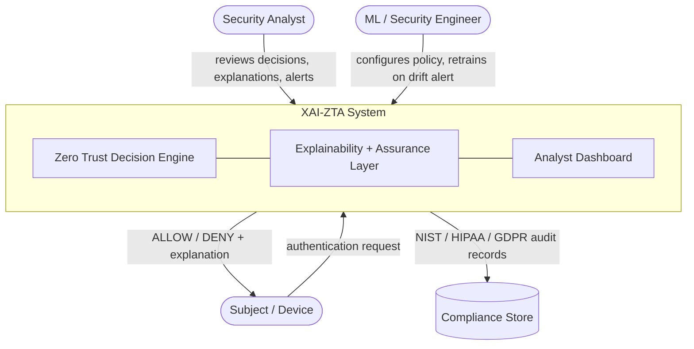
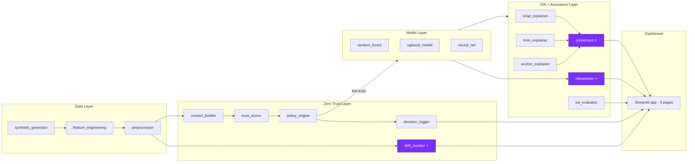
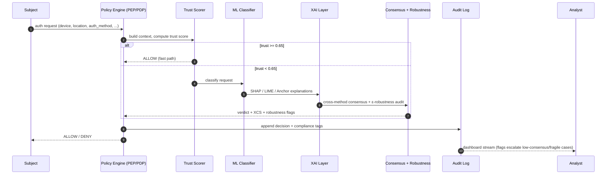
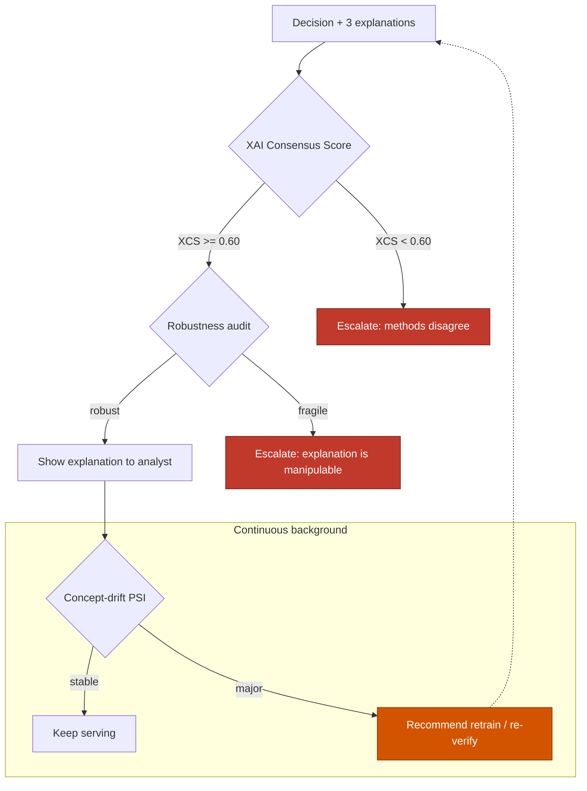

# XAI-ZTA Architecture

This document describes the architecture of XAI-ZTA using layered diagrams:
a **system context**, a **component view**, the **decision sequence**, and the
**v2.0 explanation-assurance loop** (consensus, robustness, and drift).

All diagrams are Mermaid and render natively on GitHub.

---

## 1. System Context (C4 Level 1)

---

## 2. Component View (C4 Level 2)

> ⭐ = modules added in **v2.0** (novel contributions). Highlighted in purple.

---

## 3. Decision Sequence (per authentication request)

---

## 4. Explanation-Assurance Loop (v2.0 novelty)

The core new idea: **don't trust a single explanation, and don't trust a model
forever.** Three feedback controls guard the human-in-the-loop.

---

## 5. Layer Responsibilities

| Layer | Responsibility | Key modules |
|-------|----------------|-------------|
| Data | Generate, engineer, and clean auth events | `synthetic_generator`, `feature_engineering`, `preprocessor` |
| Zero Trust | Build context, score trust, enforce NIST SP 800-207 policy, **detect drift**, log | `context_builder`, `trust_scorer`, `policy_engine`, `drift_monitor` ⭐, `decision_logger` |
| Model | Classify low-trust requests | `random_forest`, `xgboost_model`, `neural_net` |
| XAI + Assurance | Explain, **measure cross-method consensus**, **audit robustness**, evaluate | `shap_explainer`, `lime_explainer`, `anchor_explainer`, `consensus` ⭐, `robustness` ⭐, `xai_evaluator` |
| Presentation | 5-page analyst dashboard | `dashboard/app.py` + components |

---

## 6. Design Principles

1. **Fail closed, explain always** — a DENY still ships a human-readable reason.
2. **Never trust one explanation** — cross-method consensus gates analyst trust.
3. **Never trust a model forever** — drift monitoring makes "always verify"
   apply to the model itself.
4. **Latency is a security property** — the trust-gate fast path keeps p95 under
   the 500 ms real-time budget so the system degrades gracefully under load.
5. **Everything is auditable** — every decision, flag, and metric is logged and
   mapped to NIST / HIPAA / GDPR.
