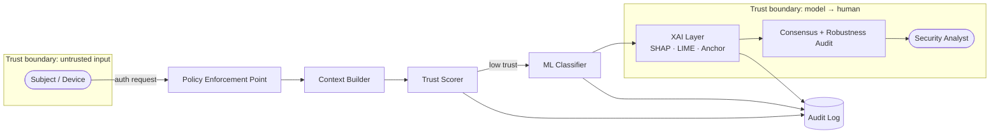
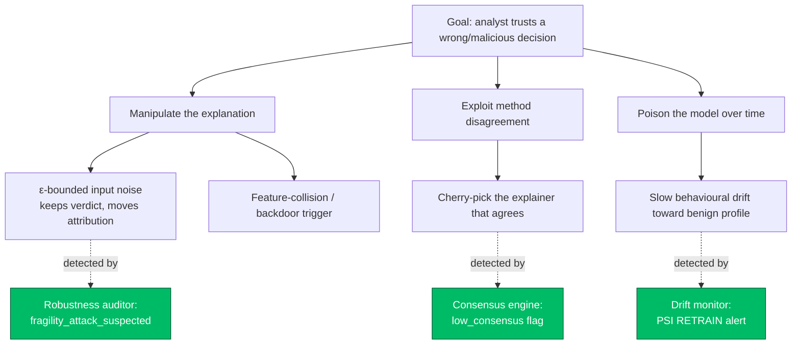

# XAI-ZTA Threat Model

This document is a **STRIDE** threat model for the XAI-ZTA authentication engine
and — crucially — for the **explainability layer** that sits on top of it. Most
threat models stop at the classifier; because XAI-ZTA puts explanations in front
of a human analyst, the *explanations themselves* become an attack surface.

- **Methodology:** STRIDE (Spoofing, Tampering, Repudiation, Information
  disclosure, Denial of service, Elevation of privilege) + explanation-specific
  attacks from the adversarial-XAI literature.
- **Assets:** access decisions, trust scores, model parameters, explanations,
  the audit log, and analyst trust.
- **Trust boundaries:** subject → PEP, PEP → policy/model, model → XAI layer,
  XAI layer → analyst, everything → audit log.

---

## 1. Data-Flow & Trust Boundaries

Every arrow that crosses a trust boundary is a place where STRIDE threats apply.

---

## 2. STRIDE Threats & Mitigations

| # | STRIDE | Threat | Asset at risk | Mitigation in XAI-ZTA |
|---|--------|--------|---------------|-----------------------|
| T1 | **S**poofing | Attacker forges device/telemetry to impersonate a trusted subject | Access decision | Multi-factor trust weighting (device + behaviour + network + auth + location); never-trust re-evaluation each request |
| T2 | **T**ampering | Perturb input telemetry to flip verdict (adversarial evasion) | Classifier | Anomaly-score feature, bounded-perturbation **robustness auditor** (`robustness.py`) surfaces unstable decisions |
| T3 | **T**ampering | **Explanation manipulation** — imperceptible noise leaves the verdict but rewrites the explanation to mislead the analyst | Analyst trust | Robustness auditor flags `fragility_attack_suspected`; low-consensus flag from `consensus.py` |
| T4 | **R**epudiation | Subject/insider denies an access event happened | Accountability | Append-only decision logger with compliance tags (`decision_logger.py`); dual export (CSV/JSON) |
| T5 | **I**nformation disclosure | **Model extraction via explanations** — querying explanations leaks the decision boundary | Model IP / security | Rate-limit explanation queries; per-decision top-k sparsity caps leaked gradient detail |
| T6 | **I**nformation disclosure | Explanations reveal PII / sensitive features | Privacy (GDPR) | Feature pseudonymisation; GDPR data-minimisation mapping in compliance page |
| T7 | **D**enial of service | Flood of low-trust requests forces expensive KernelSHAP calls | Availability | Trust-gate short-circuit (ALLOW ≥ 0.65 skips model+XAI); latency budget < 500 ms enforced |
| T8 | **E**levation of privilege | Request for resource above the subject's role | Least privilege | Policy engine denies if role < resource sensitivity |
| T9 | **T**ampering | **Behavioural drift poisoning** — slowly shift behaviour to walk the boundary | Long-term integrity | **Concept-drift monitor** (`drift_monitor.py`) PSI alerts + retrain recommendation |
| T10 | **R**epudiation | Analyst acts on a single explainer that happens to be wrong | Decision quality | **XAI Consensus Score** requires cross-method agreement before high trust |

---

## 3. Attack Tree — Deceiving the Analyst

The novel threats (T3, T5, T9, T10) share a goal: make a **malicious ALLOW look
justified**, or a **legitimate DENY look wrong**, without touching the verdict.

Each attack path terminates at a concrete, shipped detector — the three novel
modules added in v2.0 exist specifically to close these paths.

---

## 4. Residual Risk & Assumptions

| Assumption | If violated |
|------------|-------------|
| The host running the pipeline is trusted | Log tampering (T4) and model theft (T5) become trivial — out of scope |
| Training data is representative at t=0 | Drift monitor still detects *change*, but cannot fix a biased baseline |
| Analyst reads the consensus/robustness flags | Explanation attacks (T3) may succeed despite detection |
| Dependencies are patched (Dependabot + pip-audit enabled) | Supply-chain compromise |

Residual risk is documented rather than hidden: XAI-ZTA's contribution is to
make these risks **visible and measurable**, not to claim they are eliminated.
